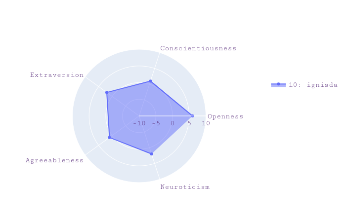

*******************************
OCEAN Personality Visualization
*******************************

.. image:: https://img.shields.io/github/license/IgnisDa/OCEAN-personality-visualization?style=for-the-badge   
	:alt: GitHub

.. image:: https://img.shields.io/travis/com/IgnisDa/OCEAN-personality-visualization?style=for-the-badge   
    :alt: Travis (.com)

A website to visualize your personality using graphs and compare it 
with others. It asks you a
series of questions and analyzes your inputs to create an easy to understand 
graph. It also provides you an
easy way to share these results with your peers and compare your personalities.
It is based on the 
OCEAN_ personality model which is the most acceptable model to measure 
personality used by researchers. 

.. _OCEAN: https://en.m.wikipedia.org/wiki/Big_Five_personality_traits 

The documentation lives at 
https://ocean-personality-visualization.readthedocs.io/en/latest/

What this website does
======================
After logging in (or signing up), you're guided to take a small
test and asked some questions. Based on your answers, a graph is
generated. This graph tell you where you stand according to the OCEAN_ personality model.

Building the Docs
=================
1) Install docs requirements: ``pip install -r docs/requirements-dev.txt``.
2) ``cd docs``
3) ``make html``
4) Open ``docs/_build/index.html`` in your browser.
